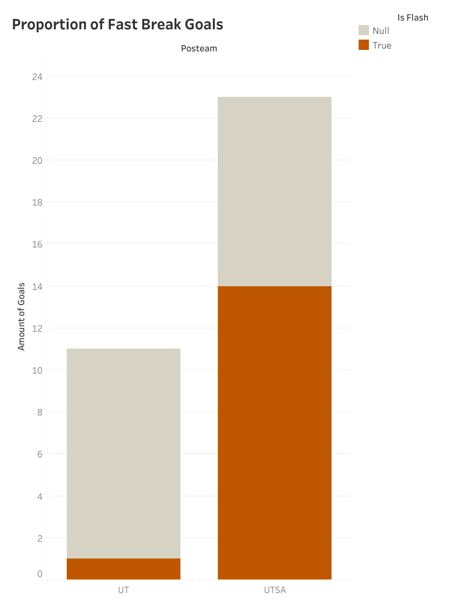
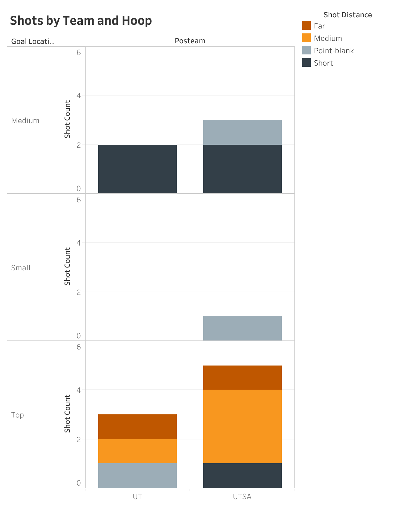
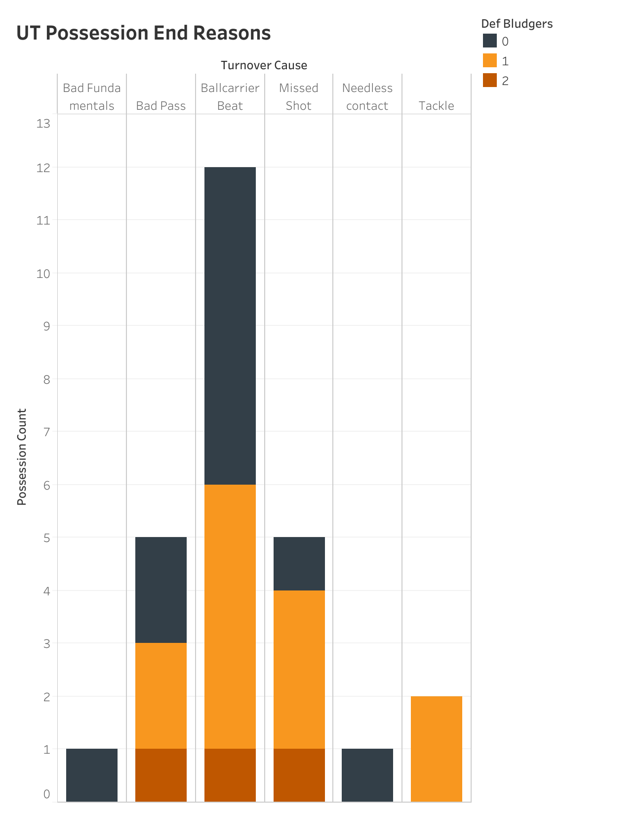
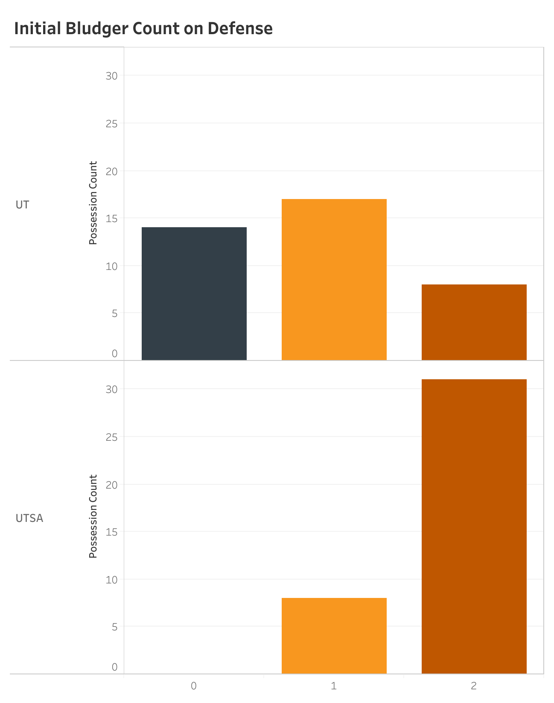

# 2025_TXQ_UTSA_LSC_Analysis
Key Question: What were the primary reasons for UT's loss against UTSA in the 2025 Lone Star Cup? How did offensive efficiency, fast breaks, and bludger control impact the final score?

## Tools Used and Methods
To complete this project, I utilized a custom data analytics workflow to process game footage from YouTube.

1.  **Data Collection:** I used `yt-dlp` and `ffmpeg` to download and standardize game footage.
2.  **Tagging:** I utilized Microsoft Excel to manually tag specific events (goals, turnovers, possession changes, and bludger states) and exported it as structured data (a CSV file).
3.  **Data Processing:** I wrote a Python script using the `pandas` library to clean the data, calculate advanced metrics (like "Time to Goal" and possession duration), and merge distinct datasets.
4.  **Visualization:** I exported the final dataset to **Tableau** to create the interactive dashboards seen below.

## Figure 1: Proportion of Fast Break Goals

To explore the data and see fast break goal counts for each team, please see the interactive dashboard published on Tableau Public: [Tableau Public](https://public.tableau.com/views/TXQAnalysis/Dashboard1?:language=en-US&publish=yes&:sid=&:redirect=auth&:display_count=n&:origin=viz_share_link)

Fast break goals are classified as when one team turns the ball over on offense and the defense is able to take advantage of an offense that is slow to return to defense, simply running the ball down to the unguarded hoops and scoring. This visualization shows the number of goals scored by each team and the number of fast break goals for them as well. UTSA scored 14 fast break goals, contributing 140 points to their final score. This was 61% of their overall goals. In contrast, UT scored only 1 fast break goal (10 points), or 9% of their total goals. It shows that UT turned the ball over frequently on offense, allowing the plethora of UTSA fast break goals. It also indicates that UT's fast break defense is not effective.

## Figure 2: Shot Breakdown by Distance and Goal Location

To explore the data and see shot counts for each team, please see the interactive dashboard published on Tableau Public: [Tableau Public](https://public.tableau.com/views/TXQAnalysis/Dashboard2?:language=en-US&publish=yes&:sid=&:redirect=auth&:display_count=n&:origin=viz_share_link)

This graph depicts the shot distribution of both teams throughout the game. It graphs both the hoop that was scored on and the distance from which they shot. UT was fairly balanced in its shot selection, but only shot at the top hoop when they were more than a few feet away from the hoops. UTSA took advantage of gaps in the UT hoops defense, scoring on shots at the top hoop quite frequently. This may be an indication of incorrect hoops rotations for the UT defense. It also shows that UTSA has a strong tendency to shoot at the top hoop when they are further than a few feet from the hoops (similar to UT). Their high number of shots also may indicate a failure in the point defenders, as they allowed them to get past them for subsequent shots (especially close shots on the medium or small hoops). However, it is difficult to pin blame as UT's lack of bludger control may well have played a part in allowing UTSA to drive in and score.

## Figure 3: Possession End Causes

To explore the data and see turnover causes and counts, please see the interactive dashboard published on Tableau Public: [Tableau Public](https://public.tableau.com/views/TXQAnalysis/Dashboard3?:language=en-US&publish=yes&:sid=&:redirect=auth&:display_count=n&:origin=viz_share_link)

This visualization shows the cause of each of UT's turnovers throughout the game and the number of bludgers UT had at the time of the turnover. The largest cause of turnovers was the ballcarrier getting beat (46% of our turnovers). We had no bludgers on offense on 50% of the turnovers due to beat ballcarriers, and we had one bludger on 42% of those turnovers; we did not have bludger control for 92% of the turnovers we suffered due to getting beat by the opponent. This suggests that these turnovers were primarily caused by a lack of protection from our beaters. The other turnover causes were primarily unforced fundamental mistakes such as bad passes, catches, missed shots, needless contact, or tackles.

## Figure 4: Initial Bludger Count on Defenses

To explore the data and see bludger counts for each team, please see the interactive dashboard published on Tableau Public: [Tableau Public](https://public.tableau.com/views/TXQAnalysis/Dashboard4?:language=en-US&publish=yes&:sid=&:redirect=auth&:display_count=n&:origin=viz_share_link)

This graph displays the number of times each team started with each bludger situation initially on defense (i.e. the team had no bludgers, one bludger, or two bludgers). This indicates that UT started with bludger control (they had 2 bludgers) on 20% of their defenses and no more than 20% of their offenses. UT started defensive possessions with no bludgers 36% of the time and with no bludgers or 1 bludger on offensive possessions 80% of the time. As a note, this graph only shows the bludger situation at the time of the starts of the defensive possessions and does not account for changes of control within the possessions.

# Conclusions
This data exploration was in preparation for playing UTSA again at the 2025 Diamond Cup in San Marcos, TX. The main takeaways were as follows:
* **Bludger Control:** UTSA was dominant in the beater game, which imploded the UT offense. We rarely had control, allowing frequent pressure and forcing bad passes.
* **Turnovers & Fast Breaks:** Pass mechanics and ball security are areas of improvement for UT. Our turnovers enabled UTSA's fast breaks, which they score in less than 10 seconds on average.
* **Hoops Defense:** The UT hoops defenders are not coordinated, allowing too many easy dunks. They need to communicate more and focus on stopping close-range shots.

The result of our initial Lone Star Cup game against UTSA was 220 (UTSA) to 135 (UT). Armed with the knowledge of UTSA's tendencies from above, our game at Diamond Cup was much closer. The final score was 150 (UTSA) to 115 (UT) and we were indeed ahead during the course of the game at several points. We were successfully able to minimize the impacts and presence of UTSA fast breaks during the game, as well as better defended shots on goals.
